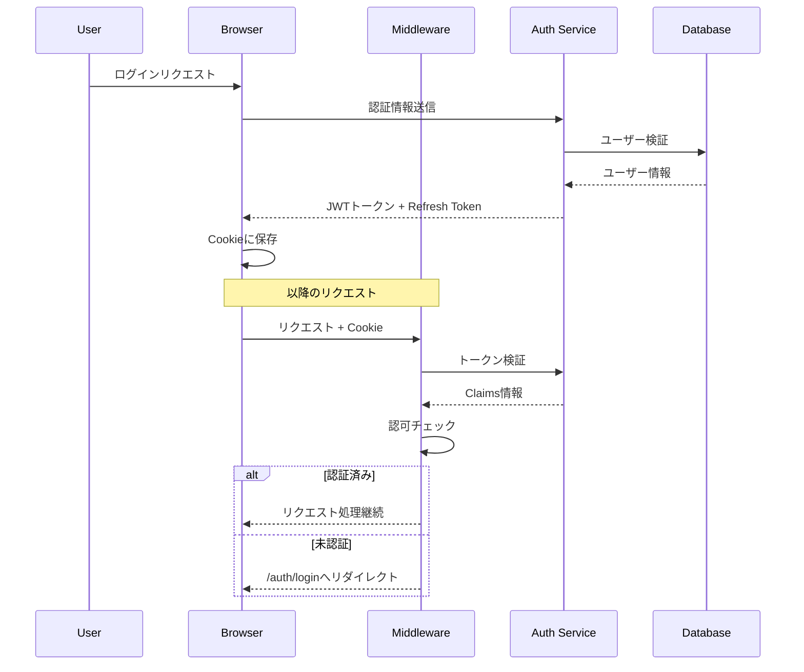
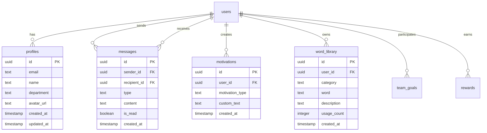
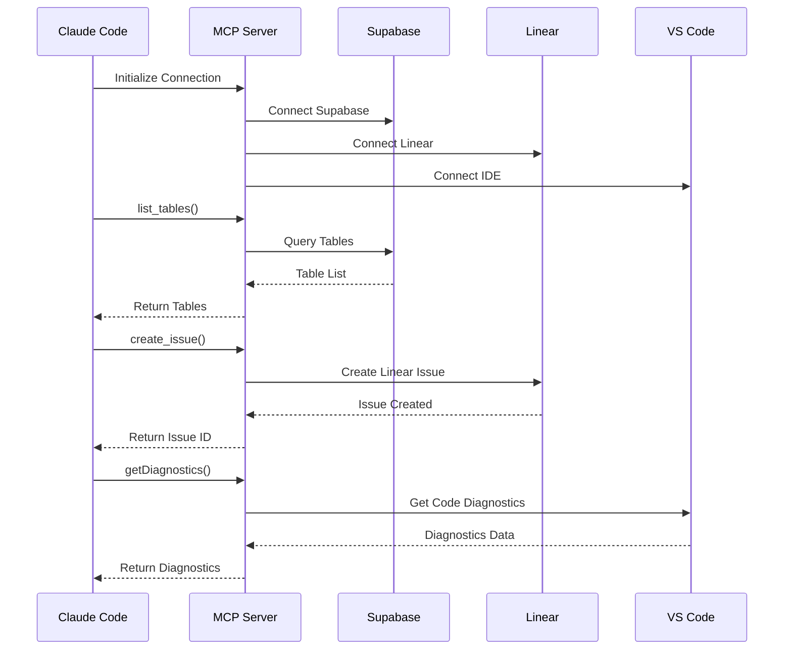

# Heartfelt 技術アーキテクチャ詳細

## 目次
1. [システム全体アーキテクチャ](#システム全体アーキテクチャ)
2. [技術スタック詳細](#技術スタック詳細)
3. [レイヤードアーキテクチャ](#レイヤードアーキテクチャ)
4. [認証・認可システム](#認証認可システム)
5. [データベース設計](#データベース設計)
6. [API設計](#api設計)
7. [セキュリティアーキテクチャ](#セキュリティアーキテクチャ)
8. [パフォーマンス最適化](#パフォーマンス最適化)
9. [デプロイメントアーキテクチャ](#デプロイメントアーキテクチャ)
10. [MCP統合アーキテクチャ](#mcp統合アーキテクチャ)

---

## システム全体アーキテクチャ

### アーキテクチャ図

```
┌─────────────────────────────────────────────────────────────────┐
│                           Client Layer                          │
├─────────────────────────────────────────────────────────────────┤
│  ┌──────────────────────────────────────────────────────────┐  │
│  │                    Browser (Next.js)                      │  │
│  │              Mobile App (Future - PWA/React Native)       │  │
│  └──────────────────────────┬───────────────────────────────┘  │
│                              │                                  │
└──────────────────────────────┼──────────────────────────────────┘
                               │
                               ▼
┌─────────────────────────────────────────────────────────────────┐
│                         Edge Layer                              │
├─────────────────────────────────────────────────────────────────┤
│  ┌──────────────────────────────────────────────────┐         │
│  │              Vercel Edge Network (CDN)            │         │
│  └──────────────────────┬───────────────────────────┘         │
│                         │                                       │
│  ┌──────────────────────▼───────────────────────────┐         │
│  │           Next.js Middleware (Auth Guard)         │         │
│  └──────────────────────┬───────────────────────────┘         │
└─────────────────────────┼───────────────────────────────────────┘
                          │
                          ▼
┌─────────────────────────────────────────────────────────────────┐
│                    Application Layer                            │
├─────────────────────────────────────────────────────────────────┤
│  ┌──────────────────────────────────────────────────┐         │
│  │               Next.js App Router                  │         │
│  ├──────────────────────────────────────────────────┤         │
│  │  ┌─────────────┐  ┌─────────────┐  ┌──────────┐ │         │
│  │  │Server Comp. │  │Route Handler│  │   API    │ │         │
│  │  └─────────────┘  └─────────────┘  └──────────┘ │         │
│  └──────────────────────┬───────────────────────────┘         │
└─────────────────────────┼───────────────────────────────────────┘
                          │
            ┌─────────────┼─────────────┬─────────────┐
            ▼             ▼             ▼             ▼
┌─────────────────────────────────────────────────────────────────┐
│                     Service Layer                               │
├─────────────────────────────────────────────────────────────────┤
│  ┌──────────────┐  ┌──────────────┐  ┌──────────────┐        │
│  │   Supabase   │  │  Claude AI   │  │   Linear     │        │
│  │   (Auth/DB)  │  │  (NLP/Gen)   │  │   (Tasks)    │        │
│  └──────┬───────┘  └──────┬───────┘  └──────┬───────┘        │
│         │                  │                  │                 │
└─────────┼──────────────────┼──────────────────┼─────────────────┘
          │                  │                  │
          ▼                  ▼                  ▼
┌─────────────────────────────────────────────────────────────────┐
│                      Data Layer                                 │
├─────────────────────────────────────────────────────────────────┤
│  ┌──────────────────────────────────────────────────┐         │
│  │           PostgreSQL (Supabase Hosted)            │         │
│  ├──────────────────────────────────────────────────┤         │
│  │  Tables: profiles, messages, motivations,         │         │
│  │          word_library, team_goals, rewards        │         │
│  └──────────────────────────────────────────────────┘         │
└─────────────────────────────────────────────────────────────────┘
```

### データフロー図

```
User Request Flow:
================
    [User] 
       │
       ▼
    [Browser]
       │
       ├─────► Static Assets ─────► [Vercel CDN] ─────► Response
       │
       ▼
    [Next.js Middleware]
       │
       ├─────► Auth Check ─────► [Supabase Auth]
       │                              │
       │                              ▼
       │                         [Session Cookie]
       │
       ▼
    [Route Handler/Page]
       │
       ├─────► Server Component ─────► [Supabase DB]
       │                                     │
       │                                     ▼
       │                              [Data Response]
       │
       ├─────► API Route ─────► [External Services]
       │                              │
       │                              ├─── Claude AI
       │                              ├─── Linear
       │                              └─── Others
       │
       ▼
    [Response]
       │
       ▼
    [Browser Render]
```

---

## 技術スタック詳細

### フロントエンド技術

#### Next.js 15 (App Router)
```typescript
// App Router の特徴
- React Server Components (RSC) によるサーバーサイドレンダリング
- Streaming SSR でパフォーマンス最適化
- Parallel Routes と Intercepting Routes
- Server Actions による直接的なデータ操作
- Turbopack による高速開発環境
```

#### React 19
```typescript
// React 19 の新機能活用
- use() hook による非同期データフェッチ
- Server Components での直接的なデータ取得
- Suspense boundaries による段階的レンダリング
- Concurrent Features の活用
```

#### TypeScript 5.x
```typescript
// 型安全性の確保
interface Database {
  public: {
    Tables: {
      profiles: {
        Row: {
          id: string;
          email: string;
          name: string | null;
          department: string | null;
          avatar_url: string | null;
          created_at: string;
          updated_at: string;
        };
        Insert: Omit<Row, 'created_at' | 'updated_at'>;
        Update: Partial<Insert>;
      };
      messages: {
        Row: {
          id: string;
          sender_id: string;
          recipient_id: string;
          type: 'thanks' | 'honesty';
          content: string;
          is_read: boolean;
          created_at: string;
        };
      };
    };
  };
}
```

### バックエンド技術

#### Supabase
```typescript
// Supabase Client Architecture
├── Browser Client (client.ts)
│   └── createBrowserClient()
│       └── Cookie-based Session Management
│
├── Server Client (server.ts)
│   └── createServerClient()
│       ├── Server Component Support
│       ├── Route Handler Support
│       └── Cookie Store Integration
│
└── Middleware Client (middleware.ts)
    └── updateSession()
        ├── Session Refresh
        ├── Auth Guard
        └── Route Protection
```

#### Edge Runtime
```typescript
// Edge Function の設定
export const runtime = 'edge'; // Vercel Edge Runtime
export const dynamic = 'force-dynamic'; // 動的レンダリング
export const revalidate = 0; // キャッシュ無効化
```

---

## レイヤードアーキテクチャ

### 1. Presentation Layer（プレゼンテーション層）

```typescript
// components/ui/ - UIコンポーネント
interface ButtonProps extends React.ButtonHTMLAttributes<HTMLButtonElement> {
  variant?: 'default' | 'destructive' | 'outline' | 'secondary' | 'ghost' | 'link';
  size?: 'default' | 'sm' | 'lg' | 'icon';
  asChild?: boolean;
}

// shadcn/ui による一貫したUI設計
- Radix UI Primitives によるアクセシビリティ
- Tailwind CSS による統一的なスタイリング
- CSS Variables によるテーマ管理
```

### 2. Application Layer（アプリケーション層）

```typescript
// app/ - ルーティングとページロジック
interface PageProps {
  params: { [key: string]: string };
  searchParams: { [key: string]: string | string[] | undefined };
}

// Server Components での非同期データ取得
async function Page({ params, searchParams }: PageProps) {
  const supabase = await createClient();
  const { data: user } = await supabase.auth.getUser();
  
  // 直接的なデータ取得
  const { data: profile } = await supabase
    .from('profiles')
    .select('*')
    .eq('id', user?.id)
    .single();
    
  return <ProfileComponent profile={profile} />;
}
```

### 3. Domain Layer（ドメイン層）

```typescript
// lib/supabase/*-actions.ts - ビジネスロジック
export async function sendMessage(
  recipientId: string,
  type: 'thanks' | 'honesty',
  content: string
) {
  const supabase = await createClient();
  const { data: user } = await supabase.auth.getUser();
  
  if (!user) throw new Error('Unauthorized');
  
  // ビジネスルールの適用
  if (content.length < 10) {
    throw new Error('メッセージは10文字以上必要です');
  }
  
  const { data, error } = await supabase
    .from('messages')
    .insert({
      sender_id: user.id,
      recipient_id: recipientId,
      type,
      content,
      is_read: false
    })
    .select()
    .single();
    
  if (error) throw error;
  return data;
}
```

### 4. Infrastructure Layer（インフラストラクチャ層）

```typescript
// lib/supabase/ - データアクセス層
const supabaseUrl = process.env.NEXT_PUBLIC_SUPABASE_URL!;
const supabaseAnonKey = process.env.NEXT_PUBLIC_SUPABASE_PUBLISHABLE_OR_ANON_KEY!;

// 環境変数バリデーション
function validateEnvironmentVariables() {
  if (!supabaseUrl || !supabaseAnonKey) {
    throw new Error('Supabase環境変数が設定されていません');
  }
  
  try {
    new URL(supabaseUrl);
  } catch {
    throw new Error('無効なSupabase URL');
  }
}
```

---

## 認証・認可システム

### 認証フロー詳細



### セッション管理

```typescript
// middleware.ts でのセッション更新
export async function updateSession(request: NextRequest) {
  const supabase = createServerClient(/* ... */);
  
  // getClaims() で自動的にセッション更新
  const { data } = await supabase.auth.getClaims();
  const user = data?.claims;
  
  // セッション有効期限の自動延長
  // Supabaseのデフォルト: 1時間（アクティブ時は自動延長）
}
```

### Row Level Security (RLS)

```sql
-- プロファイルテーブルのRLS
CREATE POLICY "Public profiles are viewable by everyone" 
ON profiles FOR SELECT USING (true);

CREATE POLICY "Users can update own profile" 
ON profiles FOR UPDATE USING (auth.uid() = id);

-- メッセージテーブルのRLS
CREATE POLICY "Users can view messages sent to them" 
ON messages FOR SELECT USING (
  auth.uid() = recipient_id OR auth.uid() = sender_id
);

CREATE POLICY "Users can send messages" 
ON messages FOR INSERT WITH CHECK (auth.uid() = sender_id);
```

---

## データベース設計

### ER図



### インデックス設計

```sql
-- パフォーマンス最適化のためのインデックス
CREATE INDEX idx_messages_recipient_created 
ON messages(recipient_id, created_at DESC);

CREATE INDEX idx_messages_sender_created 
ON messages(sender_id, created_at DESC);

CREATE INDEX idx_messages_type_created 
ON messages(type, created_at DESC);

CREATE INDEX idx_word_library_user_category 
ON word_library(user_id, category);

CREATE INDEX idx_motivations_user_type 
ON motivations(user_id, motivation_type);
```

### データベーストリガー

```sql
-- プロファイル自動作成トリガー
CREATE OR REPLACE FUNCTION public.handle_new_user() 
RETURNS TRIGGER AS $$
BEGIN
  INSERT INTO public.profiles (id, email, name)
  VALUES (
    new.id,
    new.email,
    COALESCE(
      new.raw_user_meta_data->>'name', 
      split_part(new.email, '@', 1)
    )
  );
  RETURN new;
END;
$$ LANGUAGE plpgsql SECURITY DEFINER;

-- updated_at 自動更新トリガー
CREATE OR REPLACE FUNCTION update_updated_at_column()
RETURNS TRIGGER AS $$
BEGIN
    NEW.updated_at = TIMEZONE('utc'::text, NOW());
    RETURN NEW;
END;
$$ language plpgsql;

CREATE TRIGGER update_profiles_updated_at 
BEFORE UPDATE ON profiles 
FOR EACH ROW EXECUTE FUNCTION update_updated_at_column();
```

---

## API設計

### RESTful API エンドポイント

```typescript
// Route Handlers (app/api/)
interface APIRoutes {
  // AI関連
  'POST /api/positive-writer': {
    body: { message: string };
    response: { message: string };
  };
  
  'POST /api/claude-assistant': {
    body: {
      message: string;
      systemPrompt: string;
      conversationContext?: string;
    };
    response: { message: string };
  };
  
  // 将来の拡張用
  'GET /api/messages': {
    query: { type?: 'thanks' | 'honesty'; limit?: number };
    response: Message[];
  };
  
  'POST /api/messages': {
    body: Omit<Message, 'id' | 'created_at'>;
    response: Message;
  };
}
```

### Server Actions

```typescript
// app/actions.ts - Server Actions による直接的なデータ操作
'use server';

export async function createMessage(formData: FormData) {
  const supabase = await createClient();
  const content = formData.get('content') as string;
  const type = formData.get('type') as 'thanks' | 'honesty';
  
  // バリデーション
  if (!content || content.length < 10) {
    return { error: 'メッセージは10文字以上必要です' };
  }
  
  const { data, error } = await supabase
    .from('messages')
    .insert({ content, type })
    .select()
    .single();
    
  if (error) return { error: error.message };
  
  revalidatePath('/messages');
  return { data };
}
```

### エラーハンドリング

```typescript
// 統一的なエラーレスポンス
interface APIError {
  error: string;
  code?: string;
  statusCode: number;
  details?: unknown;
}

function handleAPIError(error: unknown): NextResponse<APIError> {
  console.error('API Error:', error);
  
  if (error instanceof Error) {
    return NextResponse.json(
      {
        error: error.message,
        statusCode: 500,
        details: process.env.NODE_ENV === 'development' ? error.stack : undefined
      },
      { status: 500 }
    );
  }
  
  return NextResponse.json(
    {
      error: 'Internal Server Error',
      statusCode: 500
    },
    { status: 500 }
  );
}
```

---

## セキュリティアーキテクチャ

### セキュリティレイヤー

```
┌─────────────────────────────────────────────┐
│           1. Network Security               │
│  - HTTPS Only (TLS 1.3)                    │
│  - CSP Headers                             │
│  - CORS Policy                             │
└─────────────────────────────────────────────┘
                    ▼
┌─────────────────────────────────────────────┐
│           2. Application Security           │
│  - JWT Token Validation                     │
│  - CSRF Protection (SameSite Cookies)      │
│  - Input Validation & Sanitization         │
└─────────────────────────────────────────────┘
                    ▼
┌─────────────────────────────────────────────┐
│           3. Database Security              │
│  - Row Level Security (RLS)                │
│  - Prepared Statements                     │
│  - Encrypted at Rest                       │
└─────────────────────────────────────────────┘
```

### セキュリティヘッダー

```typescript
// next.config.ts での設定
const securityHeaders = [
  {
    key: 'X-DNS-Prefetch-Control',
    value: 'on'
  },
  {
    key: 'Strict-Transport-Security',
    value: 'max-age=63072000; includeSubDomains; preload'
  },
  {
    key: 'X-Frame-Options',
    value: 'SAMEORIGIN'
  },
  {
    key: 'X-Content-Type-Options',
    value: 'nosniff'
  },
  {
    key: 'Referrer-Policy',
    value: 'origin-when-cross-origin'
  },
  {
    key: 'Content-Security-Policy',
    value: ContentSecurityPolicy.replace(/\s{2,}/g, ' ').trim()
  }
];
```

### 環境変数の管理

```typescript
// 環境変数の分類と管理
interface EnvironmentVariables {
  // Public (クライアントサイドOK)
  NEXT_PUBLIC_SUPABASE_URL: string;
  NEXT_PUBLIC_SUPABASE_PUBLISHABLE_OR_ANON_KEY: string;
  NEXT_PUBLIC_APP_URL: string;
  
  // Private (サーバーサイドのみ)
  SUPABASE_SERVICE_ROLE_KEY?: string; // 管理者操作用
  ANTHROPIC_API_KEY?: string;
  OPENAI_API_KEY?: string;
}

// Zodによる環境変数バリデーション
import { z } from 'zod';

const envSchema = z.object({
  NEXT_PUBLIC_SUPABASE_URL: z.string().url(),
  NEXT_PUBLIC_SUPABASE_PUBLISHABLE_OR_ANON_KEY: z.string().min(1),
  ANTHROPIC_API_KEY: z.string().optional(),
});

export const env = envSchema.parse(process.env);
```

---

## パフォーマンス最適化

### レンダリング最適化

```typescript
// 1. Streaming SSR
export default async function Layout({ children }) {
  return (
    <html>
      <body>
        <Suspense fallback={<HeaderSkeleton />}>
          <Header />
        </Suspense>
        <Suspense fallback={<MainSkeleton />}>
          {children}
        </Suspense>
      </body>
    </html>
  );
}

// 2. Partial Prerendering (PPR)
export const dynamic = 'force-static'; // 静的生成
export const revalidate = 3600; // 1時間ごとに再検証

// 3. Image Optimization
import Image from 'next/image';
<Image 
  src="/hero.jpg" 
  alt="Hero" 
  width={1200} 
  height={600}
  priority // LCPの最適化
  placeholder="blur" // LQIP
/>
```

### データフェッチング最適化

```typescript
// Parallel Data Fetching
async function Page() {
  // 並列実行
  const [userData, messagesData, profileData] = await Promise.all([
    supabase.auth.getUser(),
    supabase.from('messages').select('*').limit(10),
    supabase.from('profiles').select('*').single()
  ]);
  
  return <Dashboard {...{ userData, messagesData, profileData }} />;
}

// Request Memoization
import { cache } from 'react';

const getUser = cache(async (id: string) => {
  const { data } = await supabase
    .from('profiles')
    .select('*')
    .eq('id', id)
    .single();
  return data;
});
```

### バンドルサイズ最適化

```javascript
// next.config.ts
module.exports = {
  // Tree Shaking
  swcMinify: true,
  
  // Code Splitting
  experimental: {
    optimizeCss: true,
  },
  
  // Dynamic Imports
  modularizeImports: {
    '@heroicons/react/24/outline': {
      transform: '@heroicons/react/24/outline/{{member}}',
    },
    'lucide-react': {
      transform: 'lucide-react/dist/esm/icons/{{member}}',
    },
  },
};
```

### キャッシング戦略

```typescript
// 1. CDN Cache (Vercel)
export const revalidate = 3600; // ISRで1時間キャッシュ

// 2. Browser Cache
headers: {
  'Cache-Control': 'public, max-age=31536000, immutable', // 静的アセット
}

// 3. Data Cache (Supabase)
const { data, error } = await supabase
  .from('messages')
  .select('*')
  .limit(10)
  .order('created_at', { ascending: false });

// 4. React Query / SWR for Client-side Caching
import useSWR from 'swr';

const { data, error } = useSWR('/api/messages', fetcher, {
  revalidateOnFocus: false,
  revalidateOnReconnect: false,
  refreshInterval: 60000, // 1分ごとに更新
});
```

---

## デプロイメントアーキテクチャ

### CI/CDパイプライン

```yaml
# .github/workflows/deploy.yml
name: Deploy to Vercel

on:
  push:
    branches: [main]
  pull_request:
    branches: [main]

jobs:
  deploy:
    runs-on: ubuntu-latest
    steps:
      - uses: actions/checkout@v3
      
      - name: Setup Node.js
        uses: actions/setup-node@v3
        with:
          node-version: '20'
          cache: 'npm'
      
      - name: Install dependencies
        run: npm ci
      
      - name: Run tests
        run: npm test
      
      - name: Run linter
        run: npm run lint
      
      - name: Type check
        run: npm run type-check
      
      - name: Build
        run: npm run build
      
      - name: Deploy to Vercel
        uses: vercel/action@v28
        with:
          vercel-token: ${{ secrets.VERCEL_TOKEN }}
          vercel-org-id: ${{ secrets.VERCEL_ORG_ID }}
          vercel-project-id: ${{ secrets.VERCEL_PROJECT_ID }}
```

### Infrastructure as Code

```json
// vercel.json
{
  "git": {
    "deploymentEnabled": {
      "main": true
    }
  },
  "framework": "nextjs",
  "buildCommand": "rm -rf .next && npm run build",
  "devCommand": "npm run dev",
  "installCommand": "npm install --force",
  "outputDirectory": ".next",
  "functions": {
    "app/api/claude-assistant/route.ts": {
      "maxDuration": 30
    },
    "app/api/positive-writer/route.ts": {
      "maxDuration": 30
    }
  },
  "regions": ["hnd1"], // Tokyo Region
  "env": {
    "NEXT_PUBLIC_SUPABASE_URL": "@supabase_url",
    "NEXT_PUBLIC_SUPABASE_PUBLISHABLE_OR_ANON_KEY": "@supabase_anon_key",
    "ANTHROPIC_API_KEY": "@anthropic_api_key"
  }
}
```

### モニタリング＆ログ

```typescript
// Vercel Analytics
import { Analytics } from '@vercel/analytics/react';
import { SpeedInsights } from '@vercel/speed-insights/next';

export default function RootLayout({ children }) {
  return (
    <html>
      <body>
        {children}
        <Analytics />
        <SpeedInsights />
      </body>
    </html>
  );
}

// Custom Error Tracking
import * as Sentry from '@sentry/nextjs';

Sentry.init({
  dsn: process.env.NEXT_PUBLIC_SENTRY_DSN,
  tracesSampleRate: 1.0,
  environment: process.env.NODE_ENV,
});
```

---

## MCP統合アーキテクチャ

### MCP (Model Context Protocol) の実装

```typescript
// MCP Server Configuration
interface MCPServerConfig {
  supabase: {
    type: 'supabase';
    config: {
      supabaseUrl: string;
      supabaseKey: string;
      capabilities: ['list_tables', 'execute_sql', 'apply_migration'];
    };
  };
  linear: {
    type: 'linear';
    config: {
      apiKey: string;
      capabilities: ['list_teams', 'create_issue', 'update_issue'];
    };
  };
  ide: {
    type: 'vscode';
    config: {
      capabilities: ['getDiagnostics', 'executeCode'];
    };
  };
}
```

### Claude Code Integration

```typescript
// CLAUDE.md による自動化設定
interface ClaudeCodeConfig {
  autoCommit: boolean;
  autoPush: boolean;
  commands: {
    dev: 'npm run dev';
    build: 'npm run build';
    lint: 'npm run lint';
    test: 'npm test';
  };
  mcpServers: {
    supabase: boolean;
    linear: boolean;
    ide: boolean;
  };
}

// 自動化フロー
async function claudeCodeWorkflow() {
  // 1. コード修正
  await modifyCode();
  
  // 2. リント実行
  await runCommand('npm run lint');
  
  // 3. ビルド確認
  await runCommand('npm run build');
  
  // 4. 自動コミット
  await git.add('.');
  await git.commit('feat: 機能追加');
  
  // 5. 自動プッシュ
  await git.push('origin', 'main');
  
  // 6. Vercel自動デプロイトリガー
  // (GitHubプッシュで自動実行)
}
```

### MCP通信フロー



---

## まとめ

### アーキテクチャの特徴

1. **モダンなフルスタックアーキテクチャ**
   - Next.js 15 App Router による最新のReact機能活用
   - Supabase による統合的なBaaS活用
   - Edge Runtime による高速レスポンス

2. **セキュアな設計**
   - Row Level Security による細かなアクセス制御
   - JWTトークンベースの認証
   - 環境変数の適切な分離

3. **スケーラブルな構成**
   - Vercel Edge Network によるグローバル配信
   - PostgreSQL による堅牢なデータ管理
   - マイクロサービス対応可能な設計

4. **開発効率の最大化**
   - Claude Code + MCP による自動化
   - TypeScript による型安全性
   - 自動デプロイメントパイプライン

5. **パフォーマンス最適化**
   - Streaming SSR による初期表示高速化
   - 適切なキャッシング戦略
   - バンドルサイズの最小化

この技術アーキテクチャにより、高速で安全、かつ保守性の高いWebアプリケーションを実現しています。